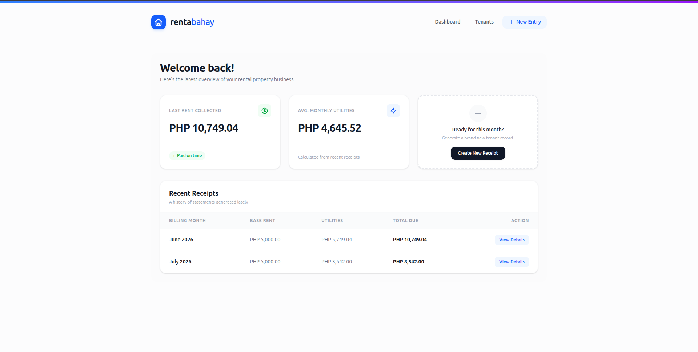
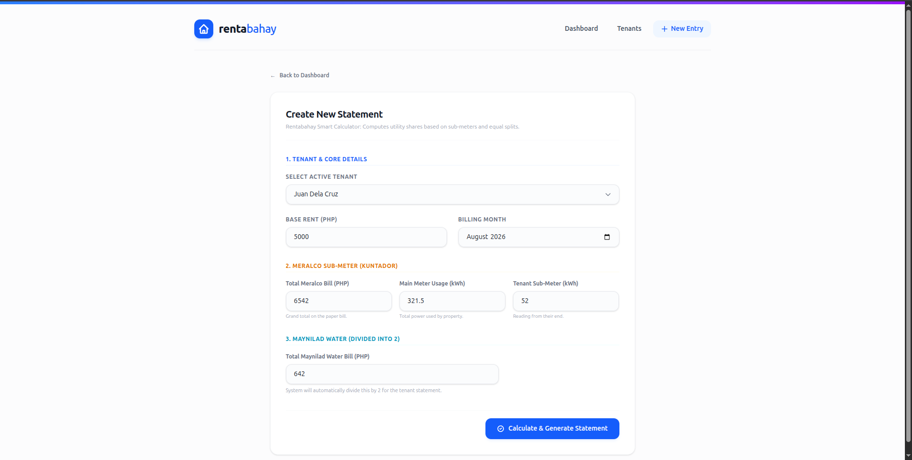
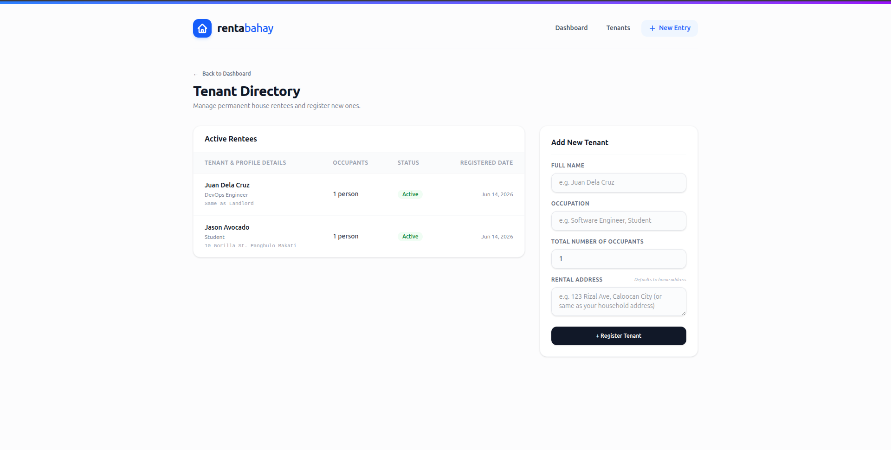
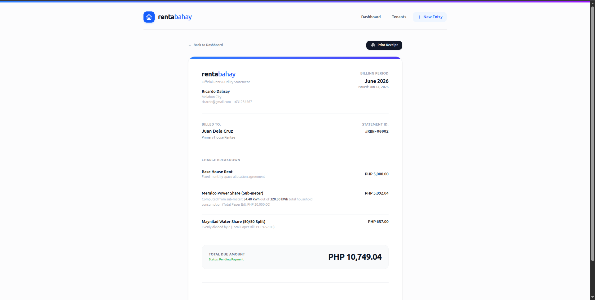
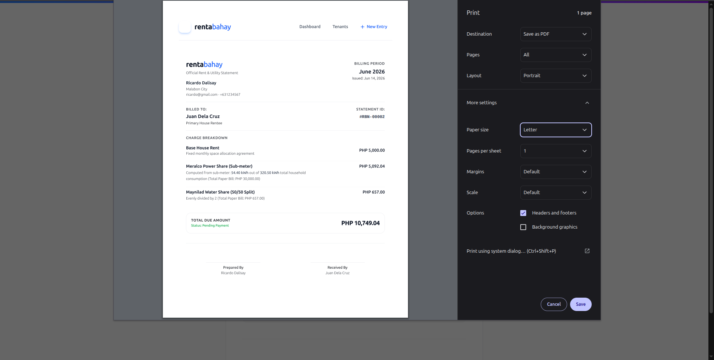

# 🏠 Rentabahay | Modern Rent & Utility Management System

Rentabahay (a play on the words *renta* and *bahay*) is a lightweight, modern, self-hosted web application built for landlords who manage split-household properties. It was specifically designed to replace messy Excel spreadsheets, making it incredibly simple to log sub-meter utility readings (like Meralco and Maynilad in the Philippines), calculate precise renter shares, and generate elegant, print-ready receipts.

Since this application is intended to run locally on a home computer or local network, it **does not require a login or authentication system**, ensuring maximum speed and simplicity for non-tech-savvy users.

<p align="center">
  
</p>

---

## ✨ Features

### 📊 Sleek SaaS Dashboard
A premium, modern "SaaS-style" command center featuring subtle gradients, tight typography, a quick welcome overview, and recent receipt tracking.

### ⚡ Dynamic Utility Splitting
Input master bills and sub-meter readings directly. The system automatically computes renter utility shares utilizing Laravel Model Accessors on the fly.
<p align="center">
  
</p>

### 👥 Tenant Profile Management
Simple directories to log rentee profiles including localized addresses, occupation, and occupant counts.
<p align="center">
  
</p>

### 🖨️ One-Page Printable Receipts & Previews
Beautiful layout optimized specifically for **A4 or Short Bond paper**. Built-in `@page` CSS rules explicitly strip away annoying browser headers/footers (like dates and URLs), and the print action button automatically hides itself when printing (`Ctrl + P`).

<p align="center">
  
  
</p>

### 🎨 Tailwind CSS Transitions
Interactive forms utilizing soft focus rings (`focus:ring-blue-500/10`) and tactile field states.

---

## 🚀 Tech Stack

* **Framework:** Laravel 11+
* **Frontend:** Blade Templates & Tailwind CSS
* **Database:** SQLite (Recommended for easy local setup) or MySQL

---

## 🛠️ Installation & Local Setup

Follow these steps to get Rentabahay running on your local machine:

### 1. Prerequisites
Ensure you have the following installed on your computer:
* PHP (>= 8.2)
* Composer
* Node.js & NPM

### 2. Clone the Repository
```bash
git clone [https://github.com/your-username/rentabahay.git](https://github.com/your-username/rentabahay.git)
cd rentabahay
```

### 3. Install the dependencies

```bash
composer install
npm install
```
### 4. Environment Configuration

Copy the sample environment file.

```bash
cp .env.example .env
```

Open the `.env` file and set up your database. For an effortless local setup, use **SQLite**:


### 5. Generate Application Key & Migrate

```bash
php artisan key:generate
php artisan migrate
```

### 6. Compile Frontend Assets

```bash
npm run build
```

### 7. Run the application

```bash
php artisan serve
```

